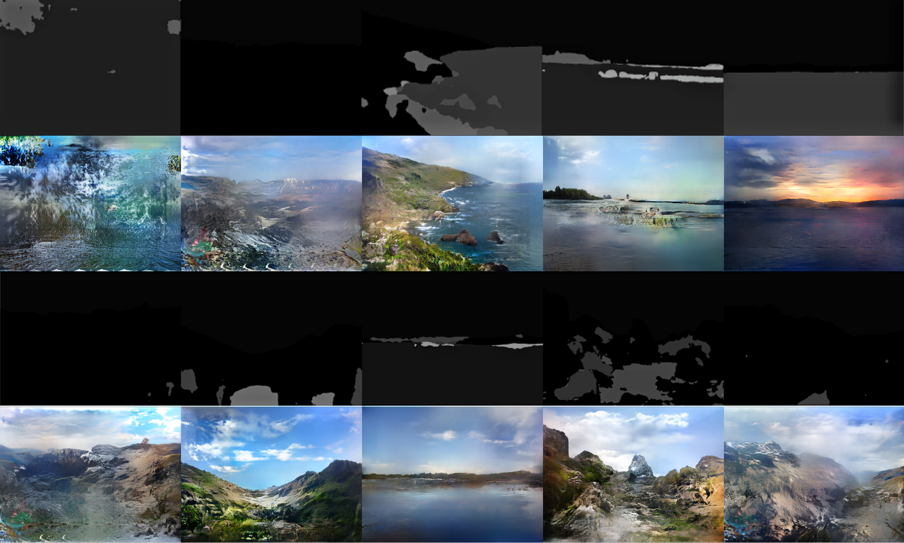
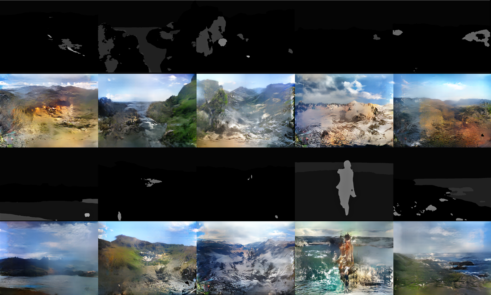
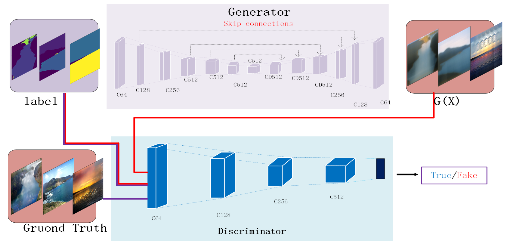
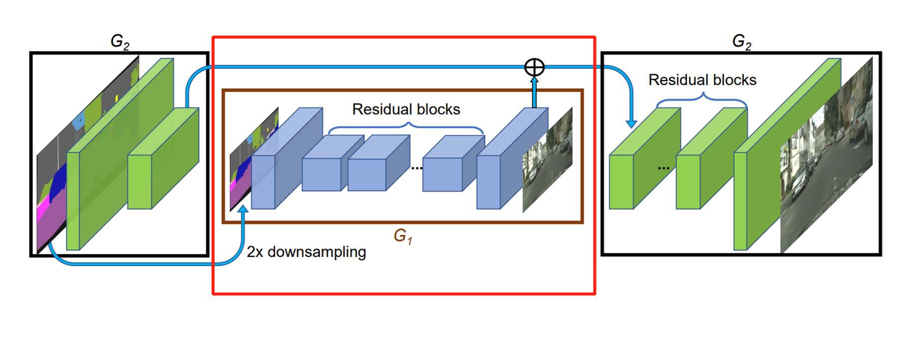

# Jittor-[黑色玫瑰的算法小能手]-[风景图片生成]
## pix2pix和pix2pixHD
## 主要结果
相对于A榜和B榜的测试集(训练集都是相同的)，本项目的两个主要结果如下图。
### A榜结果

### B榜结果


## 简介
本项目包含了第二届计图挑战赛计图 - 草图生成风景比赛的代码实现。本项目将pix2pix的生成器模型换成了pix2pixHD的全局生成器模型（G1生成器），效果相对于pix2pix有了很大的提升，图片变得更加清晰，纹理更加明显。代码中也包含了pix2pix的U-net模型和带跳跃连接的U-net模型可供选择，不同的生成器对生成图片的质量也有很大的影响。

## 安装 
本项目采用jittor的基本框架实现，具体的安装可以从[这里](https://cg.cs.tsinghua.edu.cn/jittor/download/)查看jittor详细安装教程。
#### 运行环境
- ubuntu 20.04 LTS
- python >= 3.9
- jittor >= 1.3.4.14

#### 安装依赖
执行以下命令安装 python 依赖
```
pip install -r requirements.txt
```

## 数据预处理
训练集可以点击[这里]()进行下载，A榜的测试集可以点击[这里]()下载，B榜的测试集可以点击[这里]()下载。<br />
训练集下载完成后导入`<train>`文件夹即可。
测试集下载完成后导入`<val>`文件夹即可。<br />
注意！`<train>`和`<val>`文件夹目录如下:<br />
```
├── train
│ ├── imgs
│ ├── labels
```
```
├── val
│ ├── labels
```
## 训练
本项目训练在单块Teala A100上完成的，显存为40GB，平均每200轮训练所需要的时间为2天。本项目所需要的显存大概为17GB。<br />
将训练集和测试集准备完成后可执行以下命令进行训练：
```
python pix2pix.py
```

单卡训练可运行以下命令：
```
bash scripts/train.sh
```

多卡训练可以运行以下命令：
```
bash scripts/train-multigpu.sh
```

## 推理
本项目是pix2pix与pix2pixHD相结合的，由于代码能力有限，没有完全将pix2pixHD所有的东西结合起来，仅将pix2pix生成器修改为pix2pixHD的全局生成器
两个模型图具体如下。

<center>pix2pix模型图</center> 
<br />  


<center>pix2pixHD生成器模型图</center> 
<br /> 
如上图所示，pix2pixHD的生成器模型中的G1用到了pix2pix中的生成器。<br />

## 致谢
此项目基于*Image-to-Image Translation with Conditional Adversarial Networks*（[参考代码](https://github.com/junyanz/pytorch-CycleGAN-and-pix2pix)）和*High-Resolution Image Synthesis and Semantic Manipulation with Conditional GANs* 实现（[参考代码](https://github.com/NVIDIA/pix2pixHD)）<br />
另外也参考了jittor的官方基础库，点击[这里](https://github.com/Jittor/JGAN)可以查看详细的代码。<br />
本项目也是依据jittor基础框架实现，点击[这里]()可以详细查看jittor的源代码，点击[这里](https://cg.cs.tsinghua.edu.cn/jittor/tutorial/2020-5-2-16-43-pytorchconvert/)可以查看将pytroch代码转化为jittor代码的详细教程。
